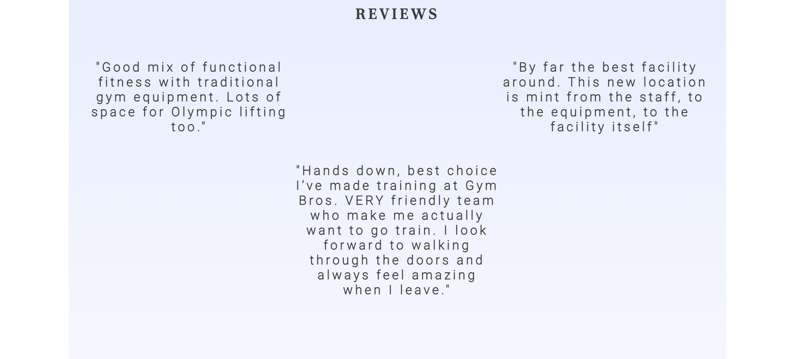
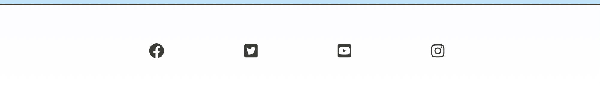
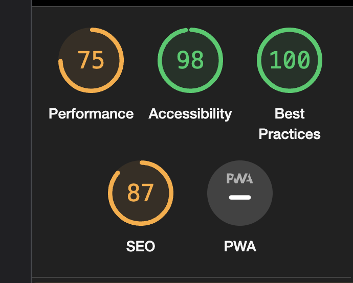

# **Introduction**
Welcome to Gym Bros! This website is the main marketing tool which provides users with information about the services, facilities and how to join the community. It has been designed to be responsive and accessible on all device platforms, which makes it user friendly.

## **User Experience (UX)**
### User stories
#### First Time Visitor Goals
- As a First Time Visitor, I want to easily understand the main purpose of the site and learn more about their services.
- As a first time Visitor, I want to quickly determine if the site is relevant for my needs.
- As a first time Visitor, i want to be able to get in contact with the business and request more information regarding a membership.
- As a First Time Visitor, I want to be able to easily navigate throughout the site to find content.
- As a First Time Visitor, I want to look for reviews to understand what their members think of gym/services and see if they are trusted.
- As a First Time Visitor, I want to locate their social links in order to connect with the communtiy.

## Design
### Colour Scheme
The two main colours used are white (background) & black for the text. Simply because black text on white background provides the highest readability. I have also introduced a blue colour in certains aspects to provide calmness.
### Typography
The Abel font is the main font used throughout the whole website with Sans Serif as the fallback font in case for any reason the font isn't being imported into the site correctly. Abel is picked for it's readbility and cleaness when added to the website.
### Imagery
The background hero image was designed to capture the users attention whilst also showing the purpose of the website. The image is simple but strong, providing the user a message with what our gym can offer them.

## Features

### Navigation Bar

Featured on the top right hand-side of the page, the full responsive navigation bar includes internal links to the sign up section, facilities section, reviews section and about us section which allows the users to to easily navigate to the section they want.

I have also added a hover style to give the user clarity when selecting from the navigation bar.

### The Landing Image

The landing includes a hero image with text overlay providing a powerful and motivational statement which captures the user attention.

I have kept the section simple and avoided to much text or multiple images as i just want to introduce the user to Gym Bros.

### Sign Up Form

This section was position straight under the hero image for ease of use for the user. It will allow the user to enquire about joining the Gym Bros community. The user will be able specify if they would like to sign up for the off peak or anytime membership. The user will be asked to submit their full name and email address.

### Facilities

This section will allow the user to see exactly what services and facilities the gym has to offer. Icons were used to draw the user attention to the selling points of the membership. Also helps break up the sections as too much text will leade to a poor user experience.

### Reviews

A small section of reviews which provides users reassurance regarding what they can expect from joining Gym Bros. The purpose of this section will help gain the users trust for the owners point of view.

### About

The about section provides the user with more information on what the business offers. The mission statement of the Gym and also the contact details for the users.

### Footer

The footer provides the user with social media links, for easy access to the Gym Bros other pages which open on in a different tab. 

## Technologies Used
### Languages Used
- HTML5
- CSS3
- Google Fonts:
- Google fonts were used to import the 'Roboto' font into the style.css file which is used on all sections throughout the project. 'Poltawski Nowy' was also imported to style all headings throught the page.
- Font Awesome:
- Font Awesome was used for the facilities section & the footer section to add icons for aesthetic and UX purposes.
- Git
- Git was used for version control by utilizing the Gitpod terminal to commit to Git and Push to GitHub.
- GitHub:
- GitHub is used to store the projects code after being pushed from Git.

## Testing
The W3C Markup Validator and W3C CSS Validator Services were used to validate every page of the project to ensure there were no syntax errors in the project.

Accessibility:

I confirm that the colours and fonts chosen are easy to read and accessible by running it through lighthouse on devtools.

## Further Testing
- Tests were done to make sure the website worked smoothly in different browsers (Google Chrome, Internet Explorer, Microsoft Edge and Safari.)
- Devtools were used to verify that the website is responsive on different viewports.
- Tests were done to ensure the sign up form is operational and that email field only accepts a valid email format.

## Known Bugs
- After testing my HTML code in W3C Markup Validator, it confirmed that i had two bugs. One extra ending div without an opening and a span was used in a incorrect way.

- i deleted the extra div and chagned the span into a div element.

## Known Issues
- For smaller screen clarity, i would have added a hamburger icon to shorten the webpage and clean up the design.
- Under the reviews section, i would add card layouts for the text again for clairty and a better user experience.

## Deployment
### GitHub Pages
The project was deployed to GitHub Pages using the following steps...

1. Log in to GitHub and locate the GitHub Repository
2. At the top of the Repository (not top of page), locate the "Settings" Button on the menu.
3. Scroll down the Settings page until you locate the "GitHub Pages" Section.
4. Under "Source", click the dropdown called "None" and select "Master Branch".
5. The page will automatically refresh.
6. Scroll back down through the page to locate the now published site link in the "GitHub Pages" section.

### Forking the GitHub Repository
By forking the GitHub Repository we make a copy of the original repository on our GitHub account to view and/or make changes without affecting the original repository by using the following steps...

1. Log in to GitHub and locate the GitHub Repository
2. At the top of the Repository (not top of page) just above the "Settings" Button on the menu, locate the "Fork" Button.
3. You should now have a copy of the original repository in your GitHub account.

The development environment used for this project was CodeAnywhere. To track the development stage and handle version control regular commits and pushes to GitHub has been conducted.

## Credits
- The full-screen hero image code came from pexels.com
- The background gradient was created using mycolour.space
- stackoverflow / w3schools / css-tricks - for developing my knowledge

## Content
All content was written by the developer and inspiration was taken from the previous 'Love Running' project we recently completed.

## Acknowledgements
My Mentor for continuous helpful feedback.